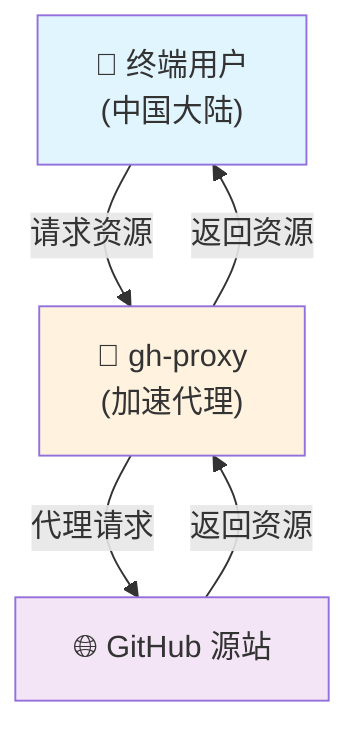

# decky-loader-cn

用于在中国大陆安装 [SteamDeckHomebrew/decky-loader](https://github.com/SteamDeckHomebrew/decky-loader) 的脚本

通过 `gh-proxy` 实现国内访问加速，修改自官方安装脚本，纯绿色无私货

## 加速原理



## 使用方式

以下四条命令中选任意一条执行即可：

```bash
curl -L https://cdn.gh-proxy.org/https://github.com/elton11220/decky-loader-cn/blob/main/scripts/install.sh | sh

curl -L https://gh-proxy.org/https://github.com/elton11220/decky-loader-cn/blob/main/scripts/install.sh | sh

curl -L https://v4.gh-proxy.org/https://github.com/elton11220/decky-loader-cn/blob/main/scripts/install.sh | sh

curl -L https://v6.gh-proxy.org/https://github.com/elton11220/decky-loader-cn/blob/main/scripts/install.sh | sh
```
